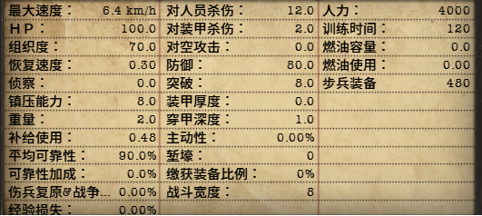

# HOI4_OfficialSC_Modify

---

钢4 官方出了简体中文 但榴莲味太重，得修改下才能入口！

受到[官方中文52汉化字体替换](https://steamcommunity.com/workshop/filedetails/?id=2977114459) 这个 mode 启发，我也弄了个字体替换的 mode。

[官方中文52汉化字体替换](https://steamcommunity.com/workshop/filedetails/?id=2977114459) 这个 mode 是把 [52汉化包](https://steamcommunity.com/workshop/filedetails/?id=698748356)的字体全搬过来整体替换，个人觉得官方简体中文中某些地方的字体还是有可取之处，如数字变大了，还有地图上的地区名称用阴影显示，个人觉得这些地方还是可以保留的，所以就想弄一个小范围使用52汉化包字体替换官方的。

---

## 修改

本mod主要修改项：
1. 众所周知地图国名，官方太恶心了，必须换成52的
2. 部队编制数值面板中的字体过小，也得换成52的
3. 修改部分翻译
   1. 「中华民国」
   2. 「北京」改为「北平」

### 字体使用

本mode 使用到了[52汉化包](https://steamcommunity.com/workshop/filedetails/?id=698748356)的地图部分的字体，在此感谢52汉化组。

编制数据项、事件正文等处之文字所使用的字体是本人使用 [bitmap font](http://www.angelcode.com/products/bmfont/)  重新制作，比52的字体稍粗。

